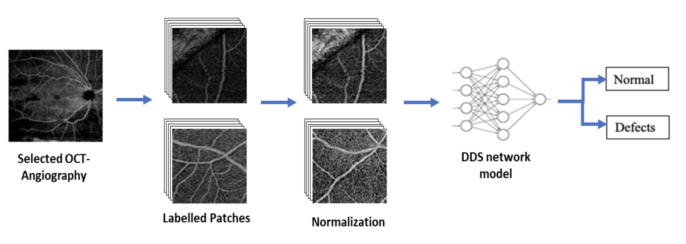
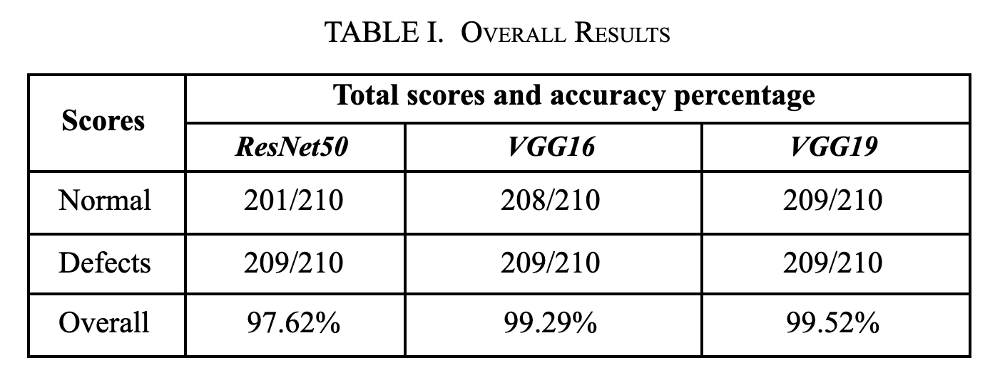
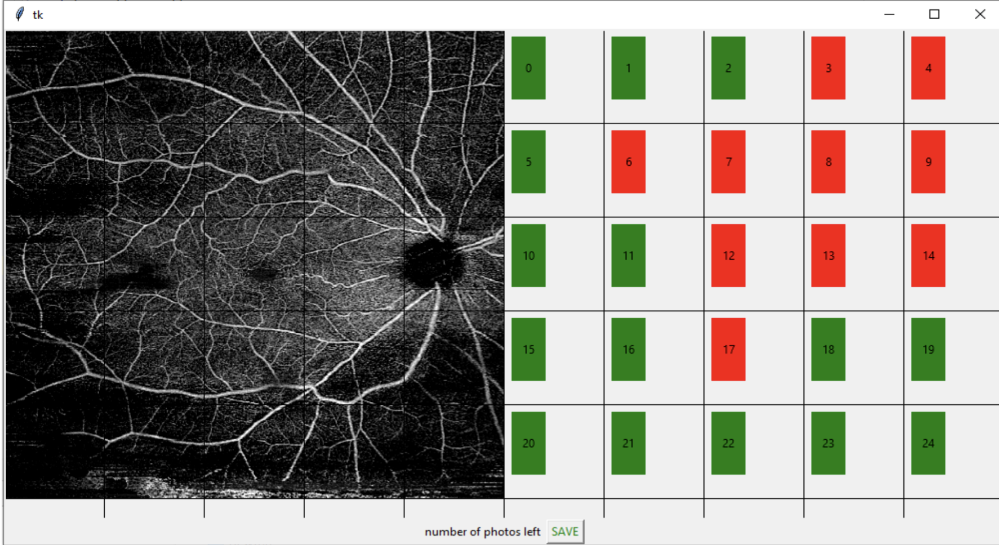

# Automated Artefacts Detection (Tensorflow Python)
Automated artefacts detection for OCT-Angiography images using deep learning image classification (CNN). The goal of this work is to develop an OCT-Angiography based image Defect Detection System (DDS) using deep learning to automatically identify the presence of artefacts in OCT-Angiography images in order to reduce misinterpretation.

# Introduction
A total of 420 patches (210 normal patches and 210 defect patches) will be used for network training and validation. 5-fold cross validation wasperformed to evaluate the accuracy. Table I shows the overall accuracy for the three networks.

# Labelling Mechanisms

